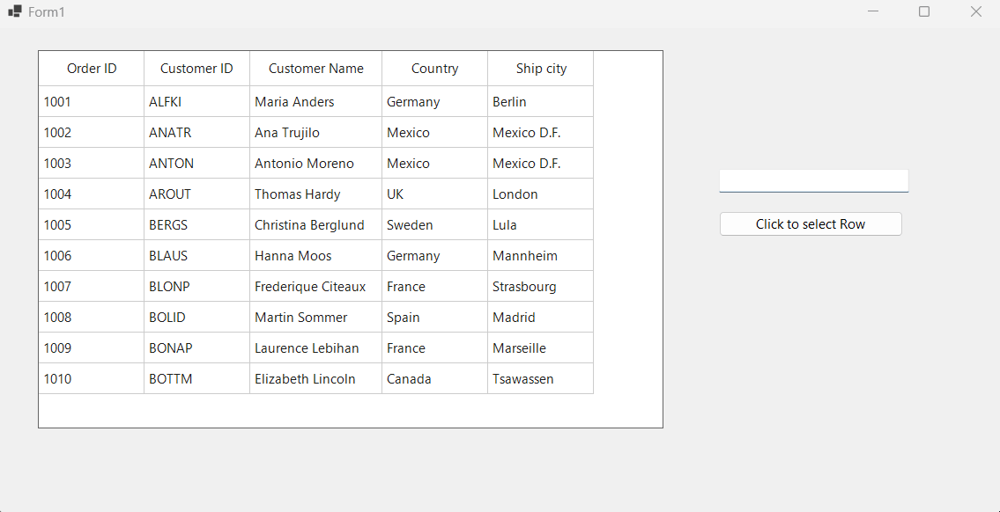

# How to select a Row by Cell Value in WinForms SfDataGrid

In a WinForms [DataGrid](https://www.syncfusion.com/winforms-ui-controls/datagrid), a row can be selected based on a specific cell value. A **TextBox** has been implemented to allow users to enter the desired cell value. If the entered value matches any value within the DataGrid columns, the corresponding row is retrieved and set as the [SelectedItem](https://help.syncfusion.com/cr/windowsforms/Syncfusion.WinForms.DataGrid.SfDataGrid.html#Syncfusion_WinForms_DataGrid_SfDataGrid_SelectedItem).
 
 ```csharp
  private void SelectRow(object sender, EventArgs e)
   {
      var rowData = orderInfoCollection.Orders.FirstOrDefault(data => data.OrderID.ToString().ToLower() == textBox1.Text.ToLower() ||
                                             data.CustomerID.ToString().ToLower() == textBox1.Text.ToLower() ||
                                             data.CustomerName.ToString().ToLower() == textBox1.Text.ToLower() ||
                                             data.ShipCity.ToString().ToLower() == textBox1.Text.ToLower() ||
                                             data.Country.ToString().ToLower() == textBox1.Text.ToLower());

      this.sfDataGrid1.SelectedItem = rowData;
   }

 ```


Take a moment to peruse the [Winforms - DataGrid Selection UG Documentation ](https://help.syncfusion.com/windowsforms/datagrid/selection), to learn more about DataGrid Selections with examples.